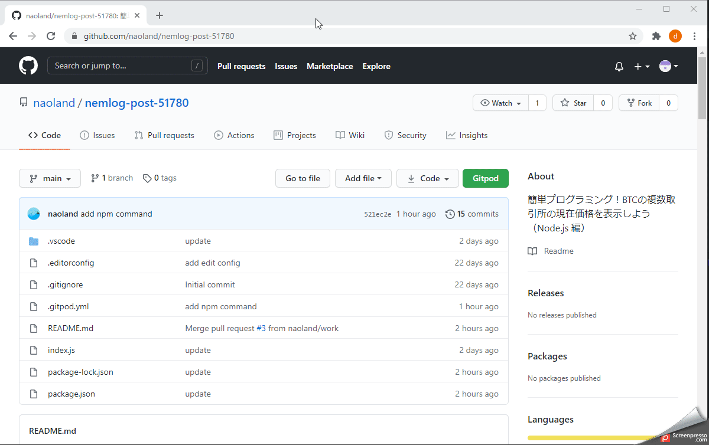

[](https://gitpod.io/#https://github.com/naoland/nemlog-post-51780)

# 簡単プログラミング！BTCの複数取引所の現在価格を表示しよう（Node.js編）

## はじめに

みなさん、こんにちは。

今回はNode.jsを使って複数の取引所の、現在のBTCの価格を表示してみます。

3つの取引所（Zaif、Bitflyer、BitBank）からBTC/JPY通貨ペアのティッカー情報を取得し、それぞれの現在価格をターミナルに表示します。
今回も動作確認はGitpodを使用します。

先に動作結果だけお見せすると、Gitpodのターミナルで次のように表示されます。
取引所毎の取得結果は、プログラムを開始して終わったものから表示されるので、表示順序は毎回変わる場合もあります。

いずれかの取引所でティッカー情報を取得中に問題が発生した場合は、途中で処理が終了し、その原因となるエラーメッセージが表示されます。

```
gitpod /workspace/nemlog-post-51780 $ node index.js 
複数の取引所からBTCの現在価格を取得します。10秒間内に取得できないとタイムアウトエラーが発生します。取得が終わった順に表示されます。
bitflyer BTC 現在価格: 2424292 JPY
bitbank BTC 現在価格: 2420197 JPY
zaif BTC 現在価格: 2422150 JPY
zaif2 BTC 現在価格: 2422150 JPY
```

## プログラムの実行手順（GIF動画）



GIF動画の内容について簡単に説明します。

まずは、記事とコードを保管しているリポジトリにアクセスしています。

https://github.com/naoland/nemlog-post-51780

1. `Gitpd`というボタンか、下の方の  をクリックします。
1. Gitpodのコンテナーが起動します。（起動中は画面中央にロゴが表示されています）
1. コンテナーが起動するとワークスペースが表示されます。
1. 必要なパッケージのインストールが行われます。
1. パッケージマネージャーの更新が行われます。

ここまで自動で行われます。

5. 実行対象のプログラムを選択しています。みなさんがこの操作を行う必要はありません。
5. ワークスペースのターミナルでプログラムを実行しています（node index.js）。`index.js`が対象プログラムです。
5. 実行結果が表示されます。

ご自身でも同様の操作をしてみてください。

<!--  -->

## プログラムの説明

```javascript
// 厳しく文法チェックします
'use strict';

// ライブラリを利用可能にします
const ccxt = require('ccxt');

// メイン関数 一番最初にコールされます。
(function () {
    console.log('複数の取引所からBTCの現在価格を取得します。10秒間内に取得できないとタイムアウトエラーが発生します。取得が終わった順に表示されます。');

    try {
        zaif();
        bitflyer();
        bitbank();
        zaif2();
    } catch (e) {
        // 何らかのエラーが発生した場合は、以下のコードが実行されます

        // エラー内容をそのまま表示
        console.log(e.message);
    }
})();

async function zaif() {
    try {
        // zaif apiの機能を使えるようにします
        const zaif = new ccxt.zaif();
        // 通貨ペアを指定します
        const pair = 'BTC/JPY';
        // ティッカー情報を同期処理として取得します
        const ticker = await zaif.fetchTicker(pair);
        // ティッカー情報の中から現在価格を表示します
        console.log(`zaif BTC 現在価格: ${ticker['last']} JPY`);
    } catch (e) {
        // 何らかのエラーが発生した場合は、以下のコードが実行されます

        // エラー内容をそのまま表示
        console.log(e.message);
    }
};

async function bitflyer() {
    try {
        // bitflyer apiの機能を使えるようにします
        const bitflyer = new ccxt.bitflyer();
        // 通貨ペアを指定します
        const pair = 'BTC/JPY';
        // ティッカー情報を同期処理として取得します
        const ticker = await bitflyer.fetchTicker(pair);
        // ティッカー情報の中から現在価格を表示します
        console.log(`bitflyer BTC 現在価格: ${ticker['last']} JPY`);
    } catch (e) {
        // 何らかのエラーが発生した場合は、以下のコードが実行されます

        // エラー内容をそのまま表示
        console.log(e.message);
    }
};

async function bitbank() {
    try {
        // bitflyer apiの機能を使えるようにします
        const bitbank = new ccxt.bitbank();
        // 通貨ペアを指定します
        const pair = 'BTC/JPY';
        // ティッカー情報を同期処理として取得します
        const ticker = await bitbank.fetchTicker(pair);
        // ティッカー情報の中から現在価格を表示します
        console.log(`bitbank BTC 現在価格: ${ticker['last']} JPY`);
    } catch (e) {
        // 何らかのエラーが発生した場合は、以下のコードが実行されます

        // エラー内容をそのまま表示
        console.log(e.message);
    }
}

// 例外が発生しても、この関数内では何もしません。上位の例外処理に任せます。
async function zaif2() {
    // zaif apiの機能を使えるようにします
    const zaif = new ccxt.zaif();
    // 通貨ペアを指定します
    const pair = 'BTC/JPY';
    // ティッカー情報を同期処理として取得します
    const ticker = await zaif.fetchTicker(pair);
    // ティッカー情報の中から現在価格を表示します
    console.log(`zaif2 BTC 現在価格: ${ticker['last']} JPY`);
};

```

基本的には[以前ご紹介したこの記事](https://github.com/naoland/nemlog-post-51408)の内容と同じです。

順番に処理が終わるのを待って次に進むのではなく、各取引所へティッカーの要求を行った後、待ち状態になり、応答が返ってきた順に表示しています。
これは`非同期処理`によって実現されます。

`zaif2`関数内では例外処理を行わずに、上位の関数で行っていません。

## まとめ

複数の取引所からBTCの現在価格を取得して表示する例を紹介しました。

ポイント  
- WEB IDEの一種である`Gitpot`で動作確認しているため、開発環境（Node.js）の導入が不要です。
- 処理が完了した順に結果が表示される（ティッカー情報を要求した取引所の順番ではない）。
- 例外処理は上位の関数に任せることができる（今回のケースではメイン関数）。
- Node.jsを使うとブラウザではなく、ターミナル上で動作を確認できる。
  - WEBアプリとして実行し、ブラウザで結果を表示することもできますが、またの機会に。

`Gitpod`でソースコード（index.js）をいろいろ変更して動作確認してみてください。理解が深まると思います。

## 関連情報へのリンク

- [簡単プログラミング！BTCの複数取引所の現在価格を表示しよう](https://github.com/naoland/nemlog-post-51408)
- [非同期関数 - JavaScript | MDN](https://developer.mozilla.org/ja/docs/Web/JavaScript/Reference/Statements/async_function)
- [try...catch 文 - JavaScript | MDN](https://developer.mozilla.org/ja/docs/Web/JavaScript/Guide/Exception_Handling_Statements/try...catch_Statement)

